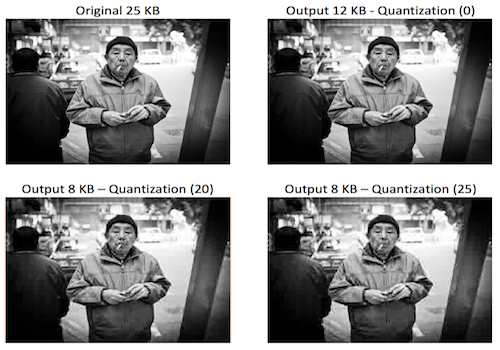

# image-compression
Image compression tool based on the Discrete Cosine Transform build using Java.

An image compression tool using the discrete cosine transform (DCT) is developed in order to exploit parallel architectures. Each of the programs implements the DCT and quantizes the image. The data is decoded afterwards in order to obtain the compressed image. 

## Versions

A shared memory version and two distributed approach using MPJ Express and sockets are implemented.

* **ImageCompression:** Version using Java threads
* **MPJImageCompression:** Version using MPJ Express
* **ParallelCompresion:** Version using sockets

## Samples

